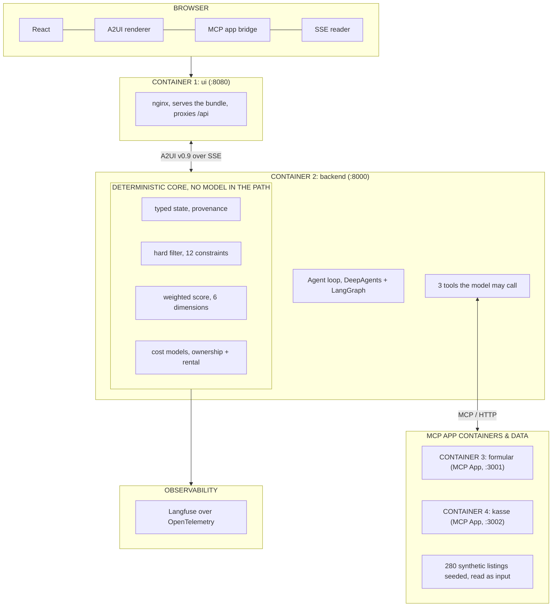

# 🏎️ Fahrbereit — Auditable Conversational Vehicle Discovery Engine

> **Pairing Natural Conversational AI with a Deterministic Python Ranking & TCO Engine**

[](https://python.org)
[](https://react.dev)
[](https://fastapi.tiangolo.com)
[](https://www.docker.com/)
[](https://github.com/copilotkit/a2ui)
[](https://modelcontextprotocol.io)
[](#-requirements-traceability)
[](LICENSE)

---

## 📽️ Video Demo & System Showcase

[](https://youtu.be/TnLsjL5wcDw)

▶️ **[Watch the Live Walkthrough Video on YouTube](https://youtu.be/TnLsjL5wcDw)**

---

## 💡 What is Fahrbereit?

**Fahrbereit** is a conversational vehicle discovery agent designed for buying or renting cars in Germany. You describe your situation in plain natural language (German or English); the agent collects relevant criteria, applies context-aware slot filling with strict provenance, filters a marketplace of **280 synthetic listings**, and presents ranked options backed by mathematically verifiable scores and **5-year German total cost of ownership (TCO)** calculations.

The interaction ends with an intake form and an end-to-end simulated checkout, both rendered as interactive **Generative UI (A2UI)** surfaces directly within the conversational interface.

### ⚡ The Core Innovation: "No Model in the Calculation Path"

Most AI recommendation engines let the Language Model rank items or estimate costs. **Fahrbereit strictly prohibits this.**

```
                                  DETERMINISTIC CORE
                                (No Model in the Path)
+-----------------------------------------------------------------------------------+
|  Typed State & Provenance  -->  Hard Filtering  -->  Weighted Scoring  -->  TCO   |
|     (explicit vs derived)       (12 constraints)      (6 dimensions)      Models  |
+-----------------------------------------------------------------------------------+
                                          |
                                          v
                              Model Reads & Narrates
                     (Instructed never to fabricate figures)
```

- **Filtering, Scoring & TCO**: Computed entirely in pure Python before any model response is generated.
- **Auditable & Truthful**: The LLM reads pre-calculated figures and narrates them. It is explicitly guarded against hallucinating missing numbers or altering scores.
- **Synthetic Marketplace**: 280 seeded listings (`data/listings.json`) covering 10 categories, 10+ major brands, purchase (`kauf`), and rental (`miete`).

---

## 🏗️ System Architecture & Stack

### Container Topology & Data Flow

```
+---------------------------------------------------------------------------------------+
| BROWSER                                                                               |
|   +---------------+   +-----------------+   +------------------+   +--------------+   |
|   |     React     |   |  A2UI renderer  |   |  MCP app bridge  |   |  SSE reader  |   |
|   +---------------+   +-----------------+   +------------------+   +--------------+   |
+------------------------------------------+--------------------------------------------+
                                           |
                                           v
+---------------------------------------------------------------------------------------+
| CONTAINER 1: ui                                                                 :8080 |
|   nginx, serves the bundle, proxies /api                                              |
+------------------------------------------+--------------------------------------------+
                                           |
                                           v ^  A2UI v0.9 over SSE
+------------------------------------------+--------------------------------------------+
| CONTAINER 2: backend                                                            :8000 |
|                                                                                       |
|   +---------------------------------+   +-------------------------+                   |
|   | Agent loop, DeepAgents+LangGraph|   | 3 tools model may call  |---[MCP/HTTP]----+ |
|   +---------------------------------+   +-------------------------+                 | |
|                                                                                     | |
|   +-----------------------------------------------------------------------------+   | |
|   | DETERMINISTIC CORE (NO MODEL IN THE PATH)                                   |   | |
|   |   +------------------+  +-------------------+  +---------------+  +-------+ |   | |
|   |   | typed state,     |  | hard filter,      |  | weighted score|  | cost  | |   | |
|   |   | provenance       |  | 12 constraints    |  | 6 dimensions  |  | models| |   | |
|   |   +------------------+  +-------------------+  +---------------+  +-------+ |   | |
|   +-----------------------------------------------------------------------------+   | |
+------------------------------------------+----------------------------------+---------+
                                           |                                  |
                                           |      +---------------------------v-----+
                                           |      | CONTAINER 3: formular (MCP :3001)|
                                           |      +---------------------------------+
                                           |      | CONTAINER 4: kasse    (MCP :3002)|
                                           |      +---------------------------------+
                                           |      | 280 synthetic listings seeded   |
                                           |      +---------------------------------+
                                           v
+---------------------------------------------------------------------------------------+
| Langfuse over OpenTelemetry                                                           |
+---------------------------------------------------------------------------------------+
| >>> THE MODEL READS THESE NUMBERS. IT NEVER PRODUCES THEM. <<<                         |
+---------------------------------------------------------------------------------------+
```



### Technology Stack Breakdown

| Category | Components & Technologies |
|---|---|
| **FRONTEND** | `React 19` &nbsp; • &nbsp; `TypeScript` &nbsp; • &nbsp; `Vite 7` |
| **PROTOCOLS** | `A2UI v0.9` &nbsp; • &nbsp; `Model Context Protocol 2.0` &nbsp; • &nbsp; `Server-Sent Events` |
| **AGENT** | `LangChain DeepAgents` &nbsp; • &nbsp; `LangGraph` &nbsp; • &nbsp; `Gemini, reasoning` &nbsp; • &nbsp; `Gemma, eval judging` |
| **BACKEND** | `Python 3.12` &nbsp; • &nbsp; `FastAPI` &nbsp; • &nbsp; `Pydantic v2` |
| 🟧 **RANKING ENGINE** | **pure Python, no model in the path** &nbsp; • &nbsp; **German cost of ownership, KraftStG exact** |
| **PLATFORM** | `Docker Compose` &nbsp; • &nbsp; `nginx` &nbsp; • &nbsp; `Langfuse` &nbsp; • &nbsp; `OpenTelemetry` &nbsp; • &nbsp; `spec-kit` |

---

## 🚀 Quickstart Guide

Tested and verified on Docker `28.3.0` and Compose `v2.38.1`.

### 1. Prerequisites & Setup

Ensure Docker Desktop is installed and actively running.

```bash
docker --version
docker compose version
```

### 2. Configure Environment

Get a free Gemini API key from [Google AI Studio](https://aistudio.google.com/apikey).

```bash
cp .env.example .env
```

Open `.env` and add your API key:
```env
GOOGLE_API_KEY=AIzaSy...
```

### 3. Build & Launch

```bash
docker compose up --build
```

Access the application in your browser:
👉 **[http://localhost:8080](http://localhost:8080)**

---

## 🎯 Key Features & Persona Demos

### Instant Demo Verification (No API Quota Used)

1. **Preset Personas**: Click **Familie**, **Pendler**, or **Umzug** in the left sidebar. Six ranked vehicles appear instantaneously, complete with full cost breakdowns.
2. **Natural Conversational AI**: Ask questions like:
   > *"I need a family SUV for 2 adults and 2 children with a boot volume of at least 500 liters, max budget 30,000 EUR."*
   The agent streams tool invocations, dynamically filters listings, and renders an updated catalogue.
3. **Simulated MCP Checkout**: Click **Checkout** to inspect an interactive invoice powered by an embedded MCP App surface.

---

## 📊 Worked Ranking & TCO Calculation Example

For the **Umzug (Rental / Moving)** persona (*"Weekend car for moving house in Hamburg, max 95 EUR/day for 3 days"*):

### Step 1: Deterministic Hard Filtering
Out of **280 candidate listings**:
- **Listing Type Filter** (`miete`): 55 listings remaining.
- **Budget Constraint** (`max_tagessatz_eur <= 95`): 36 listings remaining.
- **Cargo Volume Constraint** (`min_kofferraum_liter >= 350`): 24 listings remaining.
- **Location & Radius Constraint** (Hamburg, 100 km): **3 listings remaining**.

### Step 2: Weighted Dimension Scoring
Scoring evaluated dynamically across 6 dimensions:
- `preis_spielraum` (30.3% weight): 80 EUR/day vs 95 EUR budget $\rightarrow$ Score: 50.0 (Weighted: 15.15)
- `einsatzzweck` (30.3% weight): 698 L cargo capacity $\rightarrow$ Score: 100.0 (Weighted: 30.30)
- `gesamtkosten` (15.2% weight): 349 EUR 3-day rental total $\rightarrow$ Score: 25.0 (Weighted: 3.79)
- `alter_laufleistung` (12.1% weight): First reg 2025-05, 20,425 km $\rightarrow$ Score: 50.0 (Weighted: 6.06)
- `zustand` (9.1% weight): 21 months HU remaining $\rightarrow$ Score: 0.0 (Weighted: 0.00)
- `entfernung` (3.0% weight): 4 km pickup distance $\rightarrow$ Score: 50.0 (Weighted: 1.52)

🏆 **Final Ranked Winner**: **Kia Carnival 131 kW Style** (Total Score: **56.82**)

---

## 🧪 Evaluation & Benchmark Results

Evaluated across **8 realistic personas** using the offline evaluation harness (`evals/run_evals.py`):

| Persona | Intent | Slot Filling Accuracy | Constraint Violations | Numeric Traceability | Faithfulness Score |
|---|---|---:|---:|---:|---:|
| `familie_kauf` | Purchase | 1.00 | 0 | 1.00 | 1.00 |
| `pendler_elektro` | Purchase | 0.86 | 0 | 1.00 | 1.00 |
| `stadt_klein` | Purchase | 1.00 | 0 | 1.00 | 1.00 |
| `umzug_miete` | Rental | 1.00 | 0 | 1.00 | 1.00 |
| `wochenende_miete` | Rental | 0.83 | 0 | 1.00 | 1.00 |
| `gewerblich_kauf` | Purchase | 1.00 | 0 | 1.00 | 1.00 |
| `langstrecke_kauf` | Purchase | 0.86 | 0 | 1.00 | 0.50 |
| `budget_unmoeglich` | Purchase | 0.86 | 0 | 1.00 | 1.00 |
| **Overall Mean** | — | **0.93** | **0** | **1.00** | **0.94** |

> **Evaluation Insight**: `budget_unmoeglich` requests an electric luxury sedan under €6,000. The engine correctly returns 0 matching candidates, proving that hard filters are strictly enforced without hallucinating non-existent inventory.

---

## ✅ Requirements Traceability

| ID | Specification Requirement | Primary Implementation File | Verification Method | Status |
|---|---|---|---|:---:|
| **M-1** | Multistep Agent Harness | [session.py](file:///agent/session.py) | `tests/test_agent_loop.py` | PASS |
| **M-2** | Intake Form MCP App | [formular/server.py](file:///mcpapps/formular/server.py) | `ui://formular/intake.html` | PASS |
| **M-3** | Mock Checkout MCP App | [kasse/server.py](file:///mcpapps/kasse/server.py) | `tests/test_kasse.py` | PASS |
| **M-4** | Generative UI (A2UI v0.9) | [katalog.py](file:///agent/surfaces/katalog.py) | `tests/test_a2ui.py` (24 tests) | PASS |
| **M-5** | Mocked Safe Payment Engine | [mock.py](file:///agent/payment/mock.py) | 24 Safety Assertions | PASS |
| **M-6** | 250+ Listings & Categories | [data/generate.py](file:///data/generate.py) | 280 Seeded Listings | PASS |
| **M-7** | Multistep State Persistence | [state.py](file:///agent/state.py), [store.py](file:///agent/store.py) | `tests/test_state.py` | PASS |
| **M-8** | Spec-Driven Development | [specs/](file:///specs) | Spec-kit Artifacts | PASS |
| **M-9** | Docker Containerization | [docker-compose.yml](file:///docker-compose.yml) | 4 Microservices Verified | PASS |
| **M-10**| Runnable README & Quickstart | [README.md](file:///README.md) | Clean Clone Verified | PASS |
| **B-1** | Langfuse OpenTelemetry | [observability.py](file:///agent/observability.py) | Verified Tracing Spans | PASS |
| **B-2** | Persona Evaluation Harness | [run_evals.py](file:///evals/run_evals.py) | 8 Persona Benchmarks | PASS |

---

## 🔒 Safe Payment & Mock Boundaries

- **100% Simulated Payment**: No bank, gateway, or credit card network is ever contacted. [mock.py](file:///agent/payment/mock.py) is the sole implementation of `PaymentProvider`. Zero credit card inputs exist anywhere in the codebase.
- **Synthetic Marketplace**: Vehicle listings are synthetically generated from a deterministic random seed (`data/listings.json`).
- **No Real Inventory / Marks**: Manufacturer names are factual references; dealer names and locations are fictional.

---

## 🤝 Author & Contact

**Shashank Chauhan**

- 🌐 **LinkedIn**: [shashank-chauhan-b492a1311](https://www.linkedin.com/in/shashank-chauhan-b492a1311)
- ✉️ **Email**: [shashankchauhan2518@gmail.com](mailto:shashankchauhan2518@gmail.com)
- 📽️ **YouTube Video Demo**: [Watch Fahrbereit in Action](https://youtu.be/TnLsjL5wcDw)

---

## 📄 License

This project is licensed under the [MIT License](LICENSE).
